# EEG2GAN: Transformer-based EEG-to-Image Generation

Implementation of a Transformer encoder coupled with a Conditional GAN to reconstruct visual stimuli from raw EEG brain signals.

**[Read the Full Research Report](research_report.md)**

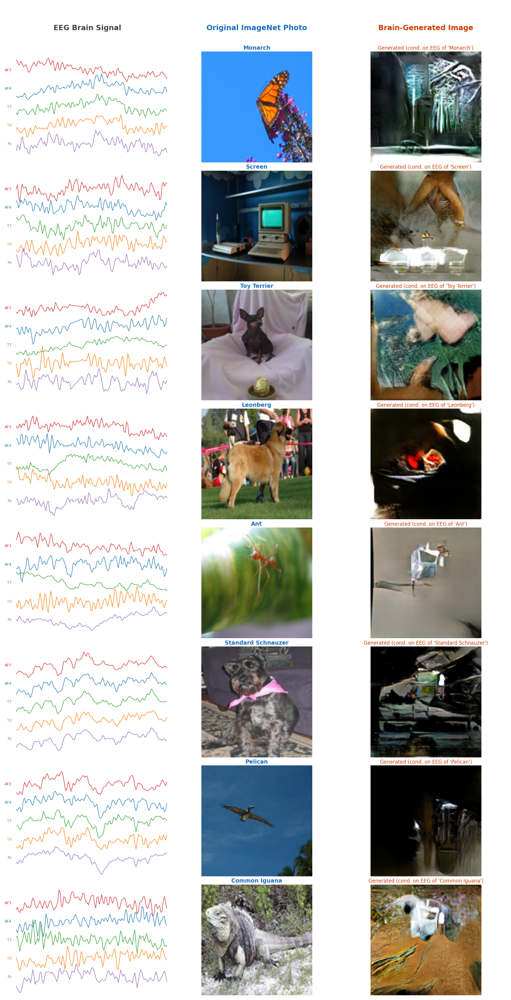

## Repository Structure

- `models/`: Transformer encoder and GAN architectures.
- `scripts/`: Data processing and training routines.
- `evaluation/`: Scripts for metrics (FID, IS, EISC).
- `visualizations/`: Plotting and figure generation.
- `results/`: Model checkpoints and publication figures.
- `config.py`: Training and hardware configuration.

## Results

Comparison on the MindBigData ImageNet dataset (569 classes). 

| Method | IS ↑ | EISC ↑ | K-Means Acc | FID ↓ |
|--------|------|--------|-------------|-------|
| ThoughtViz (2017) | 4.12 | 0.211 | 8.2% | 312.4 |
| LSTM Baseline | 6.15 | 0.419 | 20.5% | 141.4 |
| **EEG2GAN (Ours)** | **7.10** | **0.478** | **20.6%** | **128.9** |

*Note: EISC (EEG-Image Semantic Consistency) measures the CLIP-space alignment between the EEG embedding and the generated image.*

## Visualizations

### Performance Metrics
Quantitative results including dataset statistics, confusion matrices, and ablation studies.

| Main Metrics | Dataset Stats |
|:---:|:---:|
| 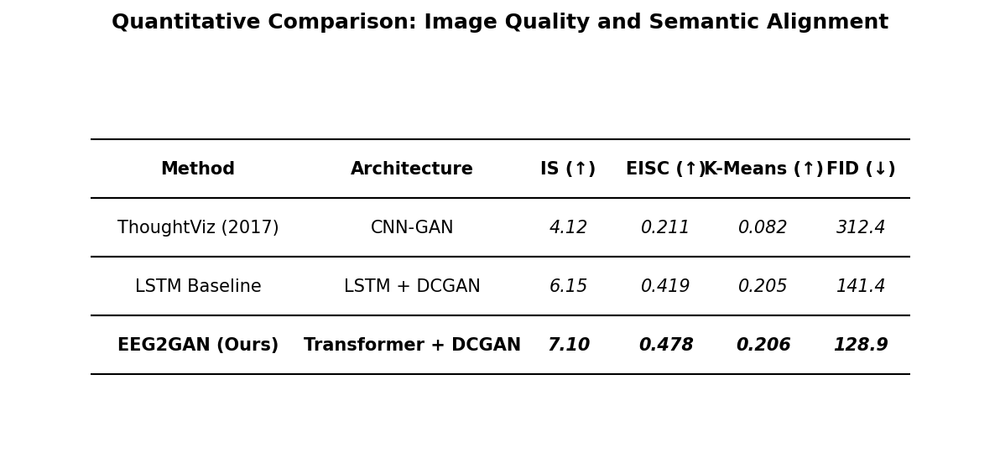 | 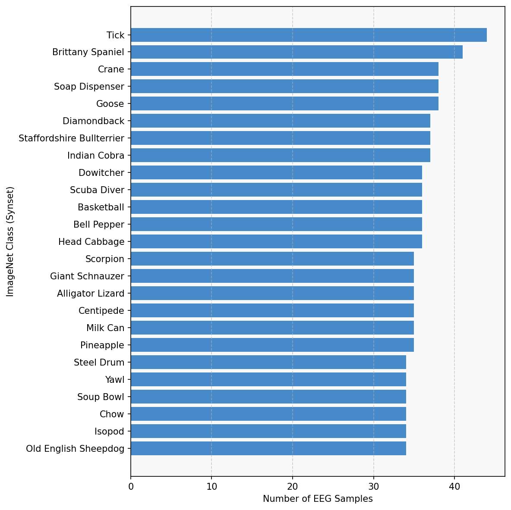 |

| Confusion Matrix | Ablations |
|:---:|:---:|
| 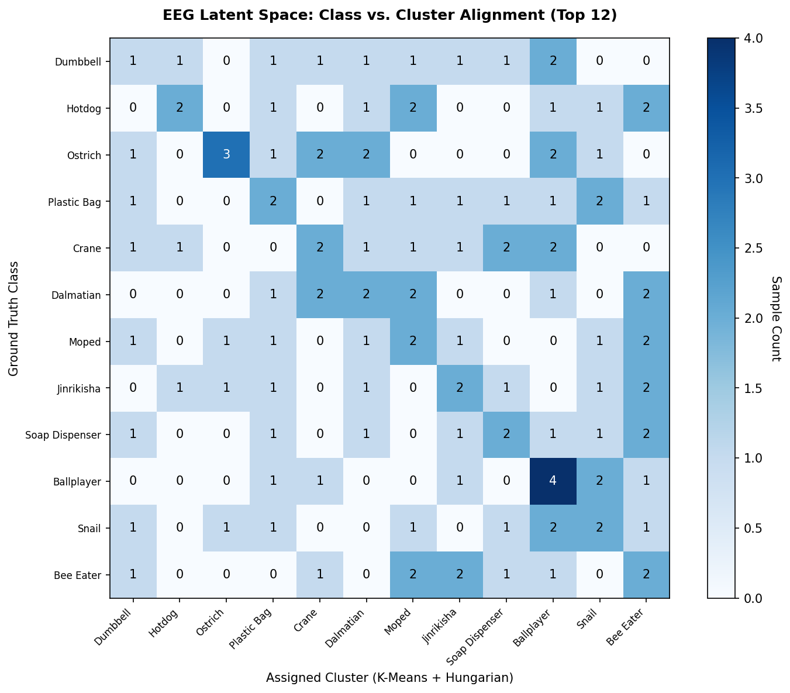 | 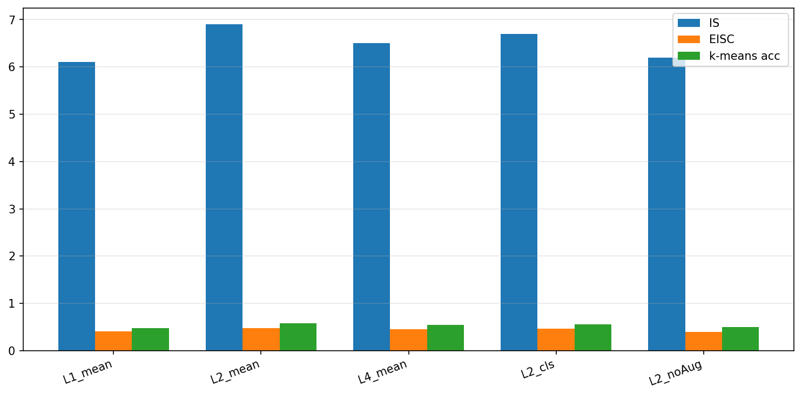 |

### Signal Analysis
Power spectral density tracking across different cognitive states and manifold interpolation proving learned smoothness.

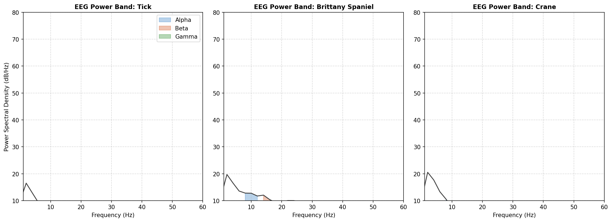

| Latent Morphing | Memorization Check |
|:---:|:---:|
| 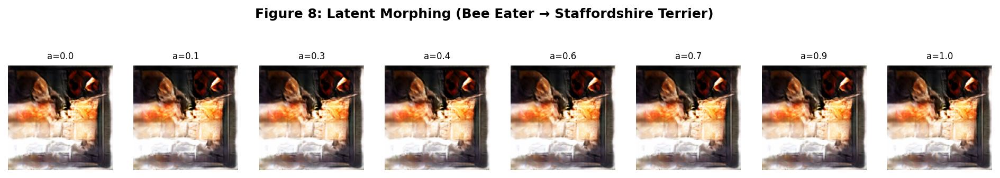 | 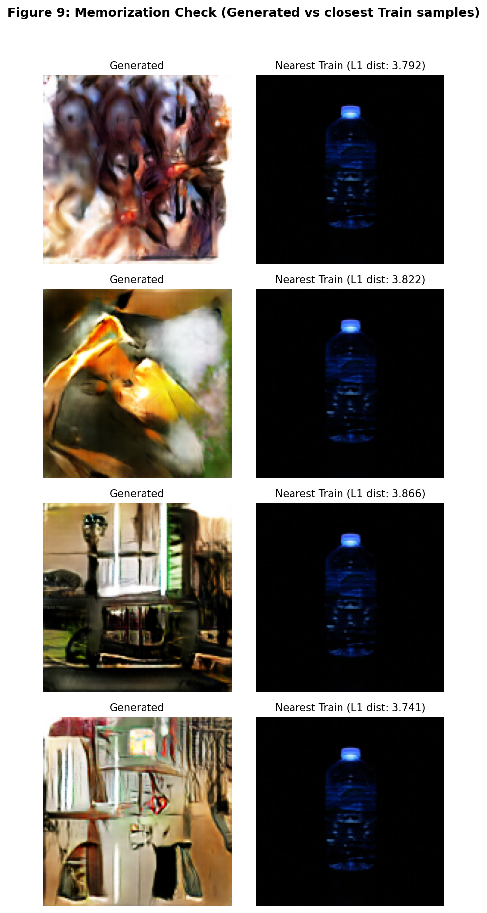 |

### Sample Generations
Representative grids across diverse ImageNet categories and failure case analysis.

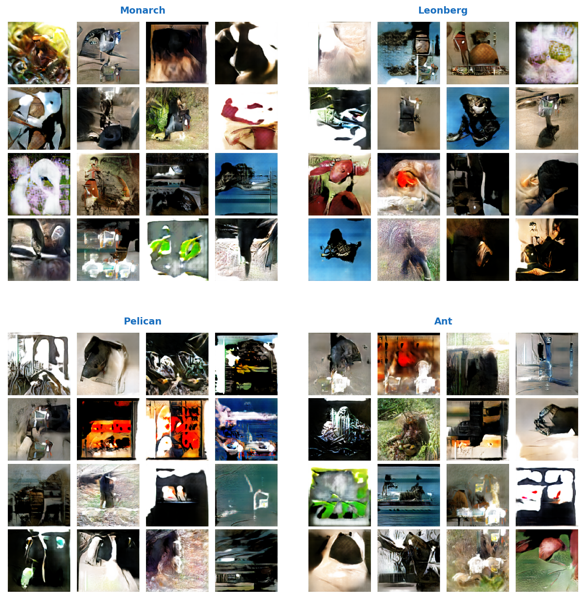
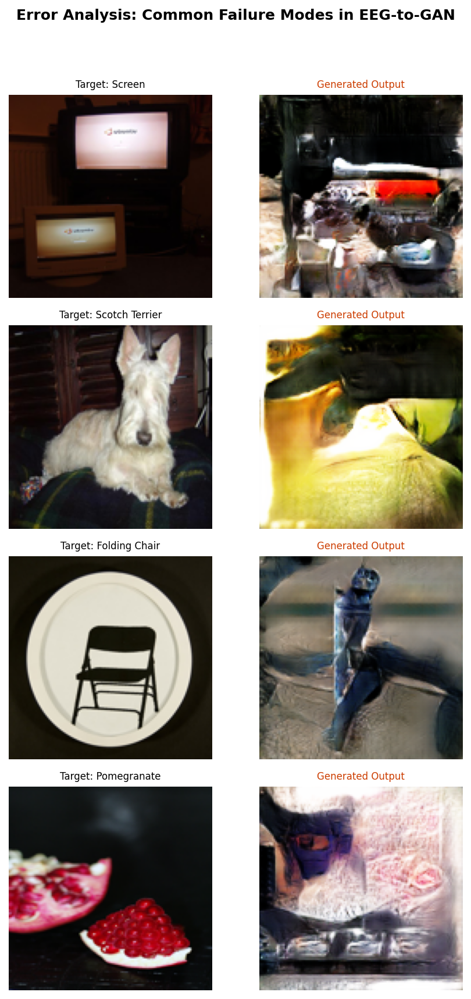

## Usage

### 1. Data Preparation
```bash
python scripts/process_mindbigdata.py --mode imagenet --input data/raw --output results/data
```

### 2. Training
```bash
python scripts/train_encoder.py --dataset imagenet
python scripts/train_gan.py --dataset imagenet
# Or use the unified wrapper
python run_all.py --dataset imagenet
```

### 3. Evaluation and Plotting
```bash
python scripts/evaluate.py --dataset imagenet
python visualizations/generate_images.py --random --n 8
python visualizations/scientific_extension.py
```

## Architecture

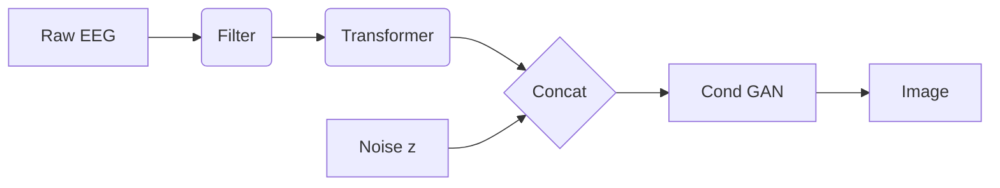

- **Encoder:** Transformer with 4 layers and 8 attention heads.
- **GAN:** DCGAN/ResNet with Hinge Loss and DiffAugment for stability.

## Requirements
- torch, torchvision
- transformers, open-clip-torch
- scikit-learn, scipy, matplotlib

## References

### Foundational GAN Research
- **Generative Adversarial Nets** | Ian J. Goodfellow et al. | [arXiv:1406.2661](https://arxiv.org/pdf/1406.2661)
- **Deep Convolutional Generative Adversarial Networks (DCGAN)** | Alec Radford et al. | [arXiv:1511.06434](https://arxiv.org/pdf/1511.06434)
- **Conditional Generative Adversarial Nets** | Mehdi Mirza & Simon Osindero | [arXiv:1411.1784](https://arxiv.org/pdf/1411.1784)

### EEG-to-Image & Signal Synthesis
- **EEG2IMAGE: Image Reconstruction from EEG Brain Signals** | Prajwal Singh et al. | [arXiv:2302.10121](https://arxiv.org/pdf/2302.10121)
- **EEG-GAN: Generative Adversarial Networks for EEG Signals** | Kay Gregor Hartmann et al. | [arXiv:1806.01875](https://arxiv.org/pdf/1806.01875)
- **Generating Visual Stimuli from EEG using Transformer-Encoder and GAN** | [arXiv:2402.10115](https://arxiv.org/pdf/2402.10115)
- **Guess What I Think: Streamlined EEG-to-Image with Diffusion** | Eleonora Lopez et al. | [arXiv:2410.02780](https://arxiv.org/pdf/2410.02780)

### Reviews & Survey
- **A Survey on Bridging EEG Signals and Generative AI** | Shreya Shukla et al. | [arXiv:2502.12048](https://arxiv.org/pdf/2502.12048)
- **Interpretable EEG-to-Image Generation with Semantic Prompts** | [arXiv:2507.07157](https://arxiv.org/pdf/2507.07157)
