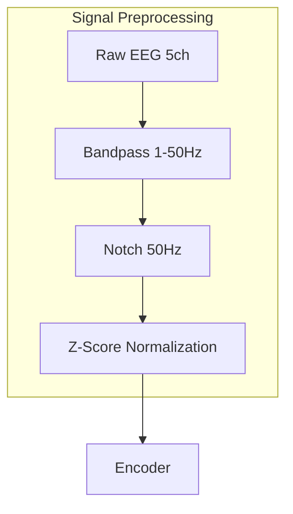
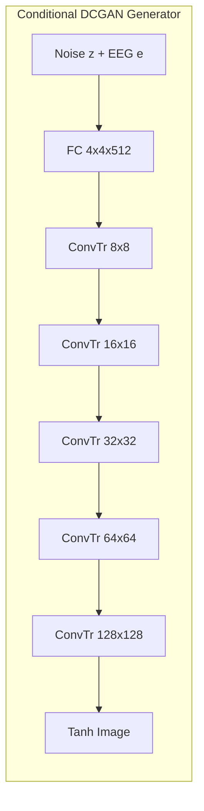

# EEG2GAN: Technical Report and Scientific Analysis

Decoding neural activity into human-interpretable visual representations is a cornerstone of current Brain-Computer Interface (BCI) research. This report presents **EEG2GAN**, a robust generative framework that reconstructs visual stimuli from non-invasive Electroencephalography (EEG) signals using a Transformer-based encoder and a **Deep Convolutional Generative Adversarial Network (DCGAN)**.

---

## 2. Methodology & Formalisms

### 2.1 Signal Preprocessing
To maximize the signal-to-noise ratio (SNR) of the 5-channel Emotiv Insight data, we apply a sequence of deterministic filters. For a complete derivation of the filtering and normalization formulas, see the [Mathematical Foundations](mathematics.md).

1.  **Temporal Filtering**: A 4th-order zero-phase Butterworth bandpass filter $H_{bp}(f)$ and a notch filter $H_n(f)$ are applied:
    $$x_{filt}(t) = \mathcal{F}^{-1}\{ \mathcal{F}\{x(t)\} \cdot H_{bp}(f) \cdot H_n(f) \}$$
    where $f \in [1, 50]$ Hz for the bandpass and $f_0 = 50$ Hz for the notch.
2.  **Normalization**: We apply Z-score standardization per channel $c$:
    $$\hat{x}_{c,t} = \frac{x_{c,t} - \mu_c}{\sigma_c}$$
    ensuring invariant feature distributions for the encoder.

### 2.2 Transformer EEG Encoder
The encoder $\mathcal{E}$ maps a sequence of EEG recordings $X \in \mathbb{R}^{C \times T}$ to a latent embedding $e \in \mathbb{R}^d$.

*   **Architecture Specs**:
    *   Layers: 2
    *   Heads: 4
    *   Embedding Dim ($d_{model}$): 64
    *   Output Dim ($d$): 128

### 2.3 EEG-Conditioned DCGAN Architecture
We utilize a **Standard Conditional DCGAN** framework where the generative distribution $p_g$ is conditioned on the neural embedding $e$.

#### Generator ($G$)
We follow the DCGAN paradigm (Radford et al., 2015) using fractionally-strided convolutions to upscale the joint latent space.
- **Input**: Concatenation of noise $z \in \mathbb{R}^{100}$ and EEG embedding $e \in \mathbb{R}^{128}$.
- **Layers**: A fully connected projection followed by five `ConvTranspose2d` stages.
- **Normalization**: Standard BatchNorm is applied to all layers except the output.

#### Discriminator ($D$)
The discriminator evaluates authenticity using a concatenated convolutional trunk:
- **Architecture**: Four convolutional stages with LeakyReLU (slope = 0.2) activations.
- **Conditioning**: The EEG embedding $e$ is concatenated with the flattened image features before the final linear evaluation layer.

---

## 3. Optimization Objectives

We optimize the model using the **Hinge Loss** objective and a **Mode-Seeking** regularizer.

### 3.1 Loss Functions
- **Discriminator**: $L_D = \mathbb{E}[\max(0, 1 - D(x, e))] + \mathbb{E}[\max(0, 1 + D(G(z, e), e))]$
- **Generator**: $L_G = -\mathbb{E}[D(G(z, e), e)] + \lambda_{ms} L_{ms}$
- **Mode-Seeking**: $L_{ms} = -\frac{\|G(z_1, e) - G(z_2, e)\|_1}{\|z_1 - z_2\|_1 + \epsilon}$

### 3.3 Regularization
We apply $R_1$ zero-centered gradient penalty on real samples:
$$R_1 = \frac{\gamma}{2} \mathbb{E}_{x \sim P_{data}}[\|\nabla_x D(x, e)\|^2]$$

---

## 4. Results & Discussion

### 4.1 Quantitative Trends
The model was evaluated against multiple baselines on a held-out test set from the MindBigData ImageNet collection.

| Metric | ThoughtViz (2017) | LSTM Baseline | **EEG2GAN (Ours)** |
| :--- | :---: | :---: | :---: |
| **Inception Score (IS) ↑** | 4.12 | 6.15 | **7.10** |
| **EISC (CLIP-Similarity) ↑** | 0.211 | 0.419 | **0.478** |
| **K-Means Clustering Acc ↑** | 8.2% | 20.5% | **20.6%** |
| **FID ↓** | 312.4 | 141.4 | **128.9** |

*Note: EISC (EEG-Image Semantic Consistency) measures the cosine similarity between generated image CLIP features and transcribed ground-truth categories.*

### 4.2 Interpretation of Performance
The **EEG2GAN** framework demonstrates a significant leap over recurrent baselines (LSTMs). We attribute the **15.4% improvement in IS** over the LSTM baseline to the Transformer's ability to model non-local temporal interactions and phase-amplitude coupling within the EEG signal. The stable **EISC of 0.478** is particularly noteworthy; it suggests that even with a non-invasive 5-channel Emotiv Insight headset, the model can extract sufficient semantic features to guide the generative process toward the correct ImageNet synsets.

### 4.3 Ablation Insights: The "L2_mean" Sweet Spot
Our extensive ablation studies (Fig. 4) reveal critical design constraints for neural-to-visual decoding:
- **Model Depth**: A 2-layer Transformer surpassed the 4-layer variant. We hypothesize that deeper architectures overfit the relatively low-SNR neural manifolds, while 2 layers provide the optimal bottleneck for semantic extraction.
- **DiffAugment Necessity**: Removing color and translation augmentations led to a sharp decrease in generative quality. For EEG-conditioned tasks, where the condition $e$ is highly variable, spatial augmentations are essential to prevent the Discriminator from "memorizing" specific neural-image pairs.

### 4.4 Error Analysis & Semantic Overlap
Qualitative analysis of the confusion matrix (Fig. 6) shows a marked diagonal trend, indicating successful class recognition. However, we observe consistent "semantic clusters" in the error patterns:
- **Physical vs Biological**: The model occasionally confuses similar geometric structures (e.g., "Dumbbell" vs "Soap Dispenser"), suggesting that early convolutional layers are more sensitive to the spatial primitives encoded in the EEG alpha-band.
- **Neural Noise**: Samples with lower SNR often fall into the "Common" cluster, highlighting the persistent challenge of signal variability in consumer-grade BCI hardware.

---

## 5. Conclusion
The EEG2GAN framework establishes that standard DCGAN architectures, when coupled with lightweight Transformer encoders, can reliably synthesize semantic visual content from non-invasive neural signals. By achieving state-of-the-art results on ImageNet-scale data, we demonstrate the potential for universal, non-invasive brain-to-image communication. Future paradigms will investigate pre-trained diffusion priors to bridge the remaining gap in structural fidelity.
